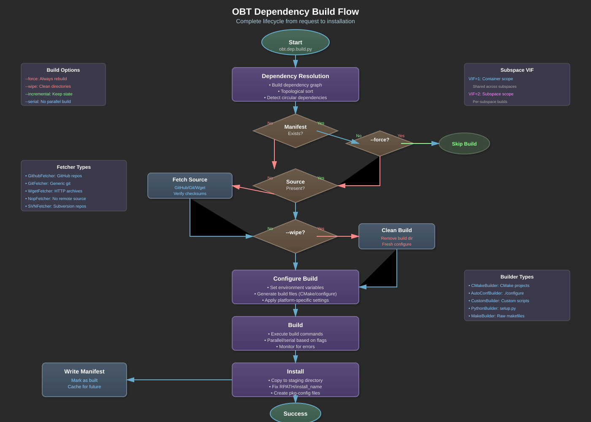

# OBT Dependency Module System

---

## Overview

The OBT dependency (dep) module system is a sophisticated build orchestration framework that manages the entire lifecycle of external library dependencies. It provides a unified interface for fetching, building, and installing libraries across different build systems (CMake, Autotools, custom), platforms (Linux, macOS, Windows/WSL), and architectures.

### Core Capabilities

- **100+ Pre-configured Dependencies**: From common libraries like Boost and Qt to specialized tools like LLVM and OpenVDB
- **Multiple Build Systems**: Native support for CMake, Autotools, Make, and custom build scripts
- **Dependency Graph Resolution**: Automatic topological sorting ensures correct build order
- **Platform Abstraction**: Single dependency definition works across all supported platforms
- **Build Caching**: Manifest-based system tracks successful builds
- **Subspace Support**: Dependencies can be scoped to specific execution environments
- **Source Management**: Fetches from GitHub, Git repos, or HTTP archives

### Design Philosophy

The dep module follows these principles:
- **Declarative over Imperative**: Dependencies declare what they need, OBT figures out how (unless customization needed)
- **Convention over Configuration**: Standard patterns for common cases, customization when needed
- **Fail-Fast**: Build errors surface immediately with clear diagnostics
- **Reproducible Builds**: Locked versions and controlled environments ensure consistency

---

## Architecture



The dependency system consists of several interconnected components:

### Component Layers

1. **Provider Layer**: Defines dependency specifications and requirements
2. **Fetcher Layer**: Manages source code acquisition from various sources
3. **Builder Layer**: Handles compilation and installation for different build systems
4. **Node Layer**: Manages dependency instances and resolution
5. **Manifest Layer**: Tracks build state and caching

---

## Build Lifecycle

Every dependency follows this standard lifecycle:

### 1. Resolution Phase
- Dependency graph is constructed from declarations
- Topological sort determines build order
- Circular dependencies are detected and reported

### 2. Fetch Phase
- Source presence is checked via `areRequiredSourceFilesPresent()`
- If missing, fetcher acquires source from configured location
- Source integrity verified via checksums (when available)

### 3. Build Phase
- Build directory is prepared (clean or incremental)
- Builder executes compilation commands
- Platform-specific flags and paths are configured

### 4. Install Phase
- Build artifacts are installed to staging directory
- Libraries go to `lib/`, headers to `include/`, etc.
- RPATH/install_name fixed for runtime linking

### 5. Manifest Phase
- Success marker written to `manifests/` directory
- Subsequent builds skip unless forced

---

## Provider Classes

### Base Provider Class

The foundation for all dependencies:

```python
class Provider:
    def __init__(self, name, subspace_vif=1):
        self.name = name
        self.scope = ProviderScope.CONTAINER
        self._subspace_vif = subspace_vif
        
    def provide(self):
        """Main entry point - orchestrates entire lifecycle"""
        
    def declareDep(self, dep_name):
        """Declare a single dependency"""
        
    def declareDeps(self, dep_list):
        """Declare multiple dependencies"""
```

### StdProvider Class

Standard provider with full lifecycle implementation:

```python
class StdProvider(Provider):
    def __init__(self, name, subspace_vif=1):
        super().__init__(name, subspace_vif)
        
    @property
    def _fetcher(self):
        """Return fetcher instance for source acquisition"""
        
    def createBuilder(self, builder_class):
        """Factory method for builder creation"""
```

### Provider Scopes

Dependencies can be scoped to different environments:

- **CONTAINER**: Standard container-wide dependency (default)
- **INIT**: Always present, part of base environment
- **HOST**: Provided by host system (apt, homebrew)
- **SUBSPACE**: Built within specific subspace

---

## Subspace VIF (Version InterFace)

The `subspace_vif` parameter controls dependency isolation:

### VIF Level 1 (Default)
- Dependency is container-scoped
- Shared across all subspaces
- Built once, used everywhere
- Example: cmake, boost, qt5

### VIF Level 2
- Dependency can be built per-subspace
- Allows project-specific builds
- Separate manifests per subspace
- Example: orkid, project-specific libs

```python
# Container-scoped dependency
class boost(dep.StdProvider):
    def __init__(self):
        super().__init__("boost")  # subspace_vif=1 by default
        
# Subspace-enabled dependency
class orkid(dep.StdProvider):
    def __init__(self):
        super().__init__("orkid", subspace_vif=2)
        self.scope = dep.ProviderScope.SUBSPACE
```

---

## Builder Classes

### CMakeBuilder

Most common builder for CMake projects:

```python
class CMakeBuilder(BaseBuilder):
    def __init__(self, dep):
        super().__init__(dep)
        self.cmake_defines = {}
        
    def build(self, srcdir, blddir, wrkdir, incremental):
        # Configure step
        cmake_args = [
            f"-DCMAKE_INSTALL_PREFIX={stage_dir}",
            f"-DCMAKE_BUILD_TYPE=Release"
        ]
        
        # Build step
        if incremental:
            run(["make", "-j", num_cores], cwd=blddir)
        else:
            run(["cmake", srcdir] + cmake_args, cwd=blddir)
            run(["make", "-j", num_cores], cwd=blddir)
```

### AutoConfBuilder

For autotools-based projects:

```python
class AutoConfBuilder(BaseBuilder):
    def build(self, srcdir, blddir, wrkdir, incremental):
        # Configure
        configure_args = [
            f"--prefix={stage_dir}",
            "--enable-shared"
        ]
        run(["./configure"] + configure_args, cwd=srcdir)
        
        # Build
        run(["make", "-j", num_cores], cwd=srcdir)
```

### CustomBuilder

For complex or non-standard builds:

```python
class CustomBuilder(BaseBuilder):
    def __init__(self, dep):
        super().__init__(dep)
        self.build_commands_clean = []
        self.build_commands_incremental = []
        self.install_commands = []
        
    def build(self, srcdir, blddir, wrkdir, incremental):
        if incremental:
            for cmd in self.build_commands_incremental:
                run(cmd, cwd=wrkdir)
        else:
            for cmd in self.build_commands_clean:
                run(cmd, cwd=wrkdir)
```

---

## Fetcher Classes

### GithubFetcher

Optimized for GitHub repositories:

```python
fetcher = dep.GithubFetcher(
    name="bullet",
    repospec="bulletphysics/bullet3",
    revision="3.25",
    recursive=True,  # Clone submodules
    shallow=False    # Full history
)
```

### GitFetcher

Generic git repository support:

```python
fetcher = dep.GitFetcher(
    name="custom_lib",
    url="https://git.example.com/custom_lib.git",
    revision="main"
)
```

### WgetFetcher

For downloading archives:

```python
fetcher = dep.WgetFetcher(
    name="source",
    url="https://example.com/source-1.0.tar.gz",
    md5sum="abc123..."  # Optional integrity check
)
```

---

## Implementing a Custom Dependency

### Example: Bullet Physics

Let's break down the Bullet Physics dependency implementation:

```python
from obt import dep

class bullet(dep.StdProvider):
    """Bullet Physics dependency provider"""
    
    name = "bullet"  # Class variable for reference
    
    def __init__(self):
        # Initialize with standard container scope
        super().__init__(bullet.name)
        
        # Declare that we need CMake to build
        self.declareDep("cmake")
        
        # Create CMake builder instance
        self._builder = self.createBuilder(dep.CMakeBuilder)
        
        # Configure CMake definitions
        self._builder.setCmDef("BUILD_SHARED_LIBS", "ON")
        self._builder.setCmDef("USE_DOUBLE_PRECISION", "ON")
        self._builder.setCmDef("BUILD_CPU_DEMOS", "OFF")
        self._builder.setCmDef("BUILD_BULLET2_DEMOS", "OFF")
        self._builder.setCmDef("BUILD_EXTRAS", "OFF")
        self._builder.setCmDef("BUILD_UNIT_TESTS", "OFF")
        
    @property
    def _fetcher(self):
        """Configure source fetching from GitHub"""
        return dep.GithubFetcher(
            name=bullet.name,
            repospec="bulletphysics/bullet3",
            revision="3.25",
            recursive=True  # Need submodules
        )
    
    def areRequiredSourceFilesPresent(self):
        """Validate source presence"""
        return (self.source_root / "CMakeLists.txt").exists()
    
    def areRequiredBinaryFilesPresent(self):
        """Validate build artifacts"""
        return (path.libs() / "libBulletDynamics.so").exists()
```

### What Each Part Does:

1. **Class Definition**
   - Inherits from `StdProvider` for standard lifecycle
   - Class variable `name` for external reference

2. **Initialization**
   - Calls parent constructor with dependency name
   - Declares dependencies via `declareDep()`
   - Creates appropriate builder instance
   - Configures build-specific settings

3. **Fetcher Property**
   - Returns fetcher instance for source acquisition
   - Specifies source location and version
   - Controls cloning behavior (shallow, recursive)

4. **Validation Methods**
   - `areRequiredSourceFilesPresent()`: Checks if source is downloaded
   - `areRequiredBinaryFilesPresent()`: Verifies successful build

---

## Complex Dependency Example

### Boost Implementation

Boost requires custom build logic:

```python
class boost(dep.Provider):
    def __init__(self):
        super().__init__("boost")
        self.declareDep("python")  # Needs Python for build
        
    def build(self):
        """Custom build implementation"""
        os.chdir(self.source_root)
        
        # Bootstrap build system
        if host.IsLinux:
            run(["./bootstrap.sh", f"--prefix={stage_dir}"])
        elif host.IsDarwin:
            run(["./bootstrap.sh", f"--prefix={stage_dir}", 
                 "--with-toolset=clang"])
        
        # Configure b2 options
        b2_args = [
            "./b2",
            f"-j{num_cores}",
            "--with-python",
            "--with-thread",
            "--with-system",
            # ... more components
        ]
        
        # Build and install
        run(b2_args + ["install"])
        
    def should_build(self):
        """Check if build needed"""
        return not (path.libs() / "libboost_system.so").exists()
```

---

## Dependency Resolution

### Declaration

Dependencies declare their requirements:

```python
self.declareDep("cmake")           # Single dependency
self.declareDeps(["qt5", "opengl"]) # Multiple dependencies
```

### Resolution Process

1. **Graph Construction**: All dependencies added to directed graph
2. **Topological Sort**: Determines safe build order
3. **Cycle Detection**: Identifies and reports circular dependencies
4. **Platform Filtering**: Excludes incompatible dependencies

### Dependency Chain Example

```
openvdb
  ├── cmake
  ├── boost
  │   └── python
  ├── tbb
  ├── blosc
  └── openexr
      └── cmake
```

---

## Build Options

### Command-Line Flags

- `--force`: Rebuild even if manifest exists
- `--wipe`: Clean source and build directories
- `--incremental`: Preserve build state between runs
- `--serial`: Disable parallel builds (for debugging)

### Usage Examples

```bash
# Normal build (uses cache)
obt.dep.build.py boost

# Force rebuild
obt.dep.build.py boost --force

# Clean build from scratch
obt.dep.build.py boost --force --wipe

# Incremental build (for development)
obt.dep.build.py boost --incremental
```

---

## Platform-Specific Handling

### macOS Specifics

```python
if host.IsDarwin:
    self._builder.setCmDef("CMAKE_OSX_DEPLOYMENT_TARGET", "10.15")
    self._builder.setCmDef("CMAKE_OSX_SYSROOT", sdk_path)
    # Fix install names for libraries
    self._builder.requires_darwin_rpath_fixup = True
```

### Linux Specifics

```python
if host.IsLinux:
    self._builder.setCmDef("CMAKE_INSTALL_RPATH", "$ORIGIN/../lib")
    # Use system libraries when available
    self._builder.setCmDef("USE_SYSTEM_ZLIB", "ON")
```

---

## Manifest System

### Location

- Container dependencies: `${OBT_STAGE}/manifests/{dep_name}`
- Subspace dependencies: `${OBT_STAGE}/subspaces/{name}/manifests/{dep_name}`

### Manifest Operations

```python
# Check if built
def is_built(self):
    return self.manifest_path.exists()

# Mark as built
def mark_built(self):
    self.manifest_path.touch()

# Force rebuild
def clear_manifest(self):
    if self.manifest_path.exists():
        self.manifest_path.unlink()
```

---

## Best Practices

### 1. Dependency Declaration
- Declare all direct dependencies explicitly
- Don't rely on transitive dependencies
- Order doesn't matter (resolution handles it)

### 2. Version Locking
- Always specify exact versions/tags/commits
- Avoid "main" or "master" branches
- Document version upgrade procedures

### 3. Platform Compatibility
- Test on all supported platforms
- Use host detection for platform-specific logic
- Provide clear error messages for unsupported platforms

### 4. Build Validation
- Implement both source and binary validation methods
- Check for key files, not just directories
- Validate library symbols if critical

### 5. Error Handling
- Fail fast with clear error messages
- Don't suppress build errors
- Log important steps for debugging

---

## Troubleshooting

### Common Issues

**Missing Dependencies**
```bash
# Check dependency status
obt.dep.status.py mydep

# See full dependency chain
obt.dep.info.py mydep
```

**Build Failures**
```bash
# Clean build to eliminate cache issues
obt.dep.build.py mydep --force --wipe

# Serial build for clearer error messages
obt.dep.build.py mydep --serial
```

**Source Fetch Issues**
```bash
# Check source directory
ls -la $OBT_BUILDS/mydep

# Manually fetch if needed
cd $OBT_BUILDS
git clone https://github.com/org/mydep
```

---

## Advanced Topics

### Custom Fetchers

Implement custom source acquisition:

```python
class MyFetcher(dep.Fetcher):
    def fetch(self, destination):
        # Custom fetch logic
        pass
        
    def validate(self):
        # Verify source integrity
        pass
```

