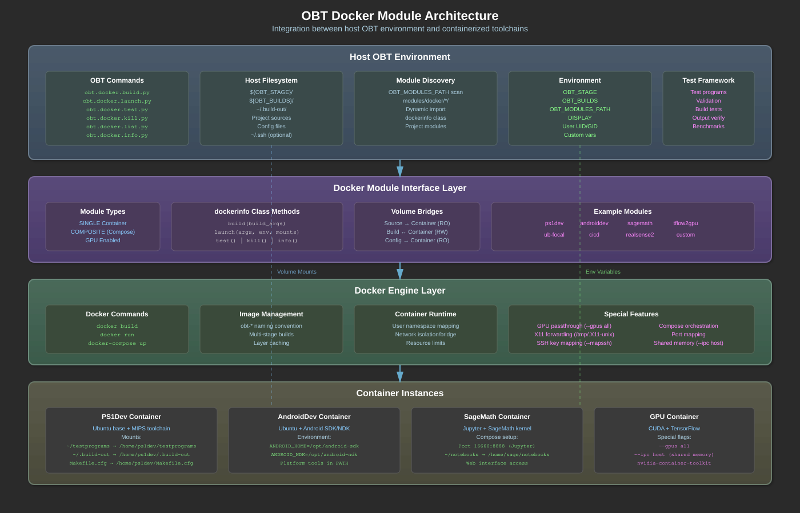

# OBT Docker Module System - Detailed Documentation

---

## Overview

The OBT Docker module system provides containerized development environments that integrate seamlessly with the host OBT build system. Unlike traditional Docker usage focused on deployment, OBT Docker modules create specialized build and development containers for specific toolchains, platforms, and workflows.

### Prerequisites

- **Docker Installation**: Docker must be installed and running
  - **macOS**: Docker Desktop must be running
  - **Linux**: Docker daemon must be active (`systemctl status docker`)
- **Docker Login**: You must be logged in to Docker Hub if pulling base images
  ```bash
  docker login
  ```
- **Permissions**: 
  - **Linux**: User should be in the `docker` group to avoid sudo
  - **macOS**: Docker Desktop handles permissions automatically

### Core Capabilities

- **Isolated Development Environments**: Each module provides a complete, reproducible toolchain
- **Host Integration**: Seamless file sharing and environment bridging with host OBT
- **Multiple Container Types**: Single containers or Docker Compose multi-service setups
- **Platform-Specific Toolchains**: PlayStation, Android, FPGA, ML/AI environments
- **Test Automation**: Built-in test frameworks for validating container functionality
- **GPU Support**: Hardware acceleration for ML/compute workloads

### Design Philosophy

- **Development over Deployment**: Containers for building, not serving
- **Host-Container Bridge**: Maintain connection to host filesystem and environment
- **Toolchain Isolation**: Keep incompatible toolchains separated
- **Reproducible Environments**: Exact toolchain versions across team members
- **Reduced Cognitive Burden**: Build products automatically organized in staging, developers focus on code not paths

---

## Architecture



The Docker module system consists of several layers:

1. **Module Discovery Layer**: Scans OBT_MODULES_PATH for available modules
2. **Module Interface Layer**: Standard Python interface for all modules
3. **Docker Integration Layer**: Manages image building and container lifecycle
4. **Volume Bridge Layer**: Connects host filesystem to containers
5. **Test Framework Layer**: Validates module functionality

---

## Module Structure

Each Docker module follows this standard structure:

```
modules/docker/<module_name>/
├── <module_name>.py      # Module implementation
├── Dockerfile            # Container definition
├── docker-compose.yml    # (Optional) Multi-container setup
├── entrypoint.sh        # (Optional) Container startup script
├── testprograms/        # (Optional) Test programs
└── config/              # (Optional) Configuration files
```

### Module Python Interface

Every module implements the `dockerinfo` class:

```python
from obt import docker

class dockerinfo:
    def __init__(self):
        self.type = docker.Type.SINGLE  # or COMPOSITE
        self._name = "module_name"
        self.imagename = "obt-module:latest"
    
    def build(self, build_args):
        """Build the Docker image"""
        pass
    
    def launch(self, launch_args, environment=None, mounts=None):
        """Launch container with specified configuration"""
        pass
    
    def test(self):
        """Run module test suite"""
        pass
    
    def kill(self):
        """Kill running containers"""
        pass
    
    def info(self):
        """Return module metadata"""
        return {"name": self._name, "image": self.imagename}
```

---

## Module Types

### Single Container Modules

Standard modules that run a single Docker container:

```python
self.type = docker.Type.SINGLE
```

Examples: ps1dev, androiddev, ubuntu-focal

### Composite Modules

Complex setups using Docker Compose:

```python
self.type = docker.Type.COMPOSITE
```

Examples: sagemath (with Jupyter), cicd (with multiple services)

---

## Building Docker Modules

### Basic Build

```bash
obt.docker.build.py <module_name>
```

### Build with Arguments

```bash
obt.docker.build.py androiddev --build-arg ANDROID_SDK_VERSION=31
```

### Platform-Specific Builds

Modules can detect host architecture and adjust:

```python
def build(self, build_args):
    if host.IsAARCH64:
        build_args.append("--platform=linux/arm64")
    
    # Add user/group for permission alignment
    build_args.extend([
        f"--build-arg=USERID={os.getuid()}",
        f"--build-arg=GROUPID={os.getgid()}"
    ])
    
    docker.build(self.imagename, context_dir, build_args)
```

---

## Launching Containers

### Interactive Shell

```bash
obt.docker.launch.py ps1dev
```

### With Environment Variables

```bash
obt.docker.launch.py androiddev --env ANDROID_HOME=/opt/android
```

### With Volume Mounts

```bash
obt.docker.launch.py ps1dev \
  --mount type=bind,source=$PWD/src,target=/home/ps1dev/src,readonly
```

### With SSH Key Mapping

```bash
obt.docker.launch.py androiddev --mapssh
```

This maps `~/.ssh` into the container for git operations.

---

## Volume Mounting Patterns

### Standard Mount Points

```python
mounts = [
    # Source code (read-only)
    docker.mount(source_dir, "/home/user/src", "ro"),
    
    # Build output (read-write) - automatically uses staging/builds/
    docker.mount(path.builds() / "module-name", "/home/user/build", "rw"),
    
    # Configuration
    docker.mount(config_file, "/home/user/.config", "ro"),
    
    # System integration
    docker.mount("/etc/timezone", "/etc/timezone", "ro"),
    docker.mount("/etc/localtime", "/etc/localtime", "ro")
]
```

**Important**: Build outputs automatically go to `${OBT_STAGE}/builds/` - developers don't need to manage paths, reducing cognitive burden and keeping the filesystem organized.

### X11 Forwarding for GUI

```python
if needs_display:
    mounts.append(docker.mount("/tmp/.X11-unix", "/tmp/.X11-unix", "rw"))
    environment["DISPLAY"] = os.environ.get("DISPLAY", ":0")
```

### GPU Access

```python
run_args = ["--gpus", "all"] if has_gpu else []
```

---

## Real Example: PS1Dev Module

The PS1Dev module provides a complete PlayStation 1 development environment:

### Module Implementation

```python
class dockerinfo:
    def __init__(self):
        super().__init__()
        self.type = docker.Type.SINGLE
        self._name = "ps1dev"
        self.imagename = "obt-ps1dev:latest"
        # Build products automatically go to OBT staging area
        self._unittest_dir = path.builds() / "ps1dev-test1"
    
    def build(self, build_args):
        """Build PS1 development container"""
        dockerfile_dir = Path(__file__).parent
        
        # Add user mapping for permissions
        build_args.extend([
            f"--build-arg=USERID={os.getuid()}",
            f"--build-arg=GROUPID={os.getgid()}"
        ])
        
        # Build the image
        cmd = ["docker", "build", "-t", self.imagename] + build_args + [dockerfile_dir]
        subprocess.run(cmd, check=True)
    
    def test(self):
        """Test PS1 toolchain with fractal demo"""
        # OBT automatically manages build directory in staging
        self._unittest_dir.mkdir(exist_ok=True)
        
        # Mount configuration and test programs
        mounts = [
            docker.mount(self.parent / "Makefile.cfg", 
                        "/home/ps1dev/Makefile.cfg", "ro"),
            docker.mount(self.parent / "testprograms", 
                        "/home/ps1dev/testprograms", "ro"),
            docker.mount(self._unittest_dir,  # Maps to staging/builds/ps1dev-test1
                        "/home/ps1dev/.build-out", "rw")
        ]
        
        # Build test program in container
        commands = [
            "cd ~/testprograms/test1",
            "make"
        ]
        
        docker.run(self.imagename, 
                  command=["bash", "-c", " && ".join(commands)],
                  mounts=mounts)
        
        # Build products are now in staging area, not scattered in home dirs
        print(f"builddir<{self._unittest_dir}>")
        # Example output:
        # builddir</Users/michael/.staging-jul17/builds/ps1dev-test1>
        # total 3264
        # -rw-r--r--  test1.bin (613872 bytes)
        # -rw-r--r--  test1.cue 
        # -rwxr-xr-x  test1.elf (336272 bytes)
        # -rw-r--r--  test1.exe (176128 bytes)
```

### Dockerfile Structure

```dockerfile
FROM ubuntu:jammy

# Install base development tools
RUN apt-get update && apt-get install -y \
    build-essential git wget cmake \
    texinfo bison flex gettext

# Build MIPS cross-compiler toolchain
WORKDIR /tmp
RUN wget https://ftp.gnu.org/gnu/binutils/binutils-2.35.tar.xz && \
    tar xf binutils-2.35.tar.xz && \
    cd binutils-2.35 && \
    ./configure --target=mipsel-unknown-elf --prefix=/usr/local && \
    make -j$(nproc) && make install

# Install PlayStation SDK
RUN git clone https://github.com/ps1dev/psxsdk.git && \
    cd psxsdk && \
    make && make install

# Create development user
ARG USERID=1000
ARG GROUPID=1000
RUN groupadd -g $GROUPID ps1dev && \
    useradd -u $USERID -g $GROUPID -m ps1dev

USER ps1dev
WORKDIR /home/ps1dev
```

### Test Program Example

The module includes a sophisticated fractal generator that validates the toolchain:

```c
// Fractal renderer for PlayStation 1
#include <psx.h>
#include <stdio.h>

// Fixed-point math for PlayStation 1 hardware
#define FIXED_SHIFT 12
#define FLOAT_TO_FIXED(x) ((int)((x) * (1 << FIXED_SHIFT)))

void render_mandelbrot() {
    // PlayStation 1 specific graphics setup
    GsSetVideoMode(320, 240, VMODE_NTSC);
    
    // Render fractal using fixed-point math
    for (int py = 0; py < 240; py++) {
        for (int px = 0; px < 320; px++) {
            // Complex number calculations
            int zr = 0, zi = 0;
            int cr = FLOAT_TO_FIXED((px - 160) * 0.01);
            int ci = FLOAT_TO_FIXED((py - 120) * 0.01);
            
            // Mandelbrot iteration
            int iter = 0;
            while (iter < MAX_ITER) {
                int zr2 = (zr * zr) >> FIXED_SHIFT;
                int zi2 = (zi * zi) >> FIXED_SHIFT;
                if (zr2 + zi2 > FLOAT_TO_FIXED(4.0)) break;
                
                int new_zr = zr2 - zi2 + cr;
                zi = ((zr * zi) >> (FIXED_SHIFT - 1)) + ci;
                zr = new_zr;
                iter++;
            }
            
            // Draw pixel with iteration-based color
            draw_pixel(px, py, get_color(iter));
        }
    }
}
```

---

## Complex Module Example: SageMath

The SageMath module demonstrates Docker Compose integration:

### Docker Compose Configuration

```yaml
version: '3'

services:
  jupyter:
    image: obt/sagemath-jupyter:9.6
    container_name: obt-sagemath
    ports:
      - "16666:8888"
    volumes:
      - ./notebooks:/home/sage/notebooks
      - ~/.sage:/home/sage/.sage
    environment:
      - JUPYTER_ENABLE_LAB=yes
    command: start-notebook.sh --NotebookApp.token=''
```

### Module Implementation

```python
def launch(self, launch_args, environment=None, mounts=None):
    """Launch Jupyter with SageMath kernel"""
    compose_file = self.parent / "docker-compose.yml"
    
    cmd = ["docker-compose", "-f", compose_file, "up", "-d"]
    subprocess.run(cmd, check=True)
    
    print("SageMath Jupyter available at http://localhost:16666")
```

---

## GPU-Enabled Modules

For machine learning and compute workloads:

### TensorFlow GPU Module

```python
def launch(self, launch_args, environment=None, mounts=None):
    """Launch with GPU access"""
    run_args = [
        "--gpus", "all",  # Enable all GPUs
        "--ipc", "host",  # Shared memory for performance
        "-v", "/tmp/.X11-unix:/tmp/.X11-unix",  # GUI support
        "-e", f"DISPLAY={os.environ.get('DISPLAY', ':0')}"
    ]
    
    docker.run(self.imagename, run_args=run_args, 
               command=["python3", "/workspace/train.py"])
```

---

## Environment Variable Management

### Passing Host Environment

```python
def launch(self, launch_args, environment=None, mounts=None):
    # Inherit specific host variables
    env_vars = {
        "HOME": "/home/developer",
        "USER": "developer",
        "TERM": os.environ.get("TERM", "xterm-256color"),
        "LANG": os.environ.get("LANG", "en_US.UTF-8")
    }
    
    # Add custom environment
    if environment:
        env_vars.update(environment)
    
    # Convert to Docker format
    docker_env = [f"-e {k}={v}" for k, v in env_vars.items()]
```

### OBT Integration Variables

```python
# Pass OBT paths to container
env_vars = {
    "OBT_STAGE": path.stage(),
    "OBT_BUILDS": path.builds(),
    "OBT_HOST": host.name()
}
```

---

## Testing Docker Modules

### Test Framework

Each module can implement comprehensive tests:

```python
def test(self):
    """Run module test suite"""
    test_dir = path.builds() / f"{self._name}-test"
    test_dir.mkdir(exist_ok=True)
    
    # Run test commands
    test_script = """
    echo "Running toolchain tests..."
    gcc --version
    make --version
    # Custom validation
    """
    
    result = docker.run(self.imagename, 
                       command=["bash", "-c", test_script],
                       capture_output=True)
    
    # Validate results
    assert "gcc" in result.stdout
    print("All tests passed!")
```

### Automated Test Execution

```bash
# Test single module
obt.docker.test.py ps1dev

# Test all modules
for module in $(obt.docker.list.py); do
    obt.docker.test.py $module
done
```

---

## Module Discovery

### Dynamic Loading

Modules are discovered at runtime:

```python
def enumerate_docker_modules():
    """Find all Docker modules in OBT_MODULES_PATH"""
    modules = []
    for path in obt_modules_paths():
        docker_dir = path / "docker"
        if docker_dir.exists():
            for module_dir in docker_dir.iterdir():
                if (module_dir / f"{module_dir.name}.py").exists():
                    modules.append(module_dir.name)
    return modules
```

### Module Registration

No explicit registration needed - presence in filesystem is sufficient:

```bash
# List all available modules
obt.docker.list.py

# Get module information
obt.docker.info.py ps1dev
```

---

## Best Practices

### 1. User Permission Alignment

Always map host user/group IDs:

```dockerfile
ARG USERID=1000
ARG GROUPID=1000
RUN useradd -u $USERID -g $GROUPID developer
```

### 2. Minimal Base Images

Start with minimal base and add only what's needed:

```dockerfile
FROM ubuntu:jammy AS base
# Only essential packages

FROM base AS builder
# Build tools only for compilation

FROM base AS runtime
# Copy artifacts from builder
```

### 3. Volume Mount Strategy

- Source code: Read-only to prevent accidental modification
- Build output: Dedicated directory per module
- Configuration: Mount specific files, not entire directories
- Secrets: Use --mapssh flag, don't bake into images

### 4. Container Lifecycle

```python
def kill(self):
    """Clean shutdown of containers"""
    # Kill specific container, not all
    cmd = ["docker", "kill", f"obt-{self._name}"]
    subprocess.run(cmd, capture_output=True)
    
    # Clean up volumes if needed
    self._cleanup_volumes()
```

### 5. Error Handling

```python
def build(self, build_args):
    try:
        docker.build(self.imagename, self.parent, build_args)
    except subprocess.CalledProcessError as e:
        print(f"Build failed: {e}")
        # Attempt cleanup
        docker.rmi(self.imagename, force=True)
        raise
```

---

## Troubleshooting

### Common Issues

**Docker Not Running**
```bash
# macOS - Docker Desktop must be running
# Check Docker Desktop app is running in menu bar
# If not, launch Docker Desktop from Applications

# Linux - Check Docker daemon
systemctl status docker
sudo systemctl start docker  # if not running
```

**Not Logged In to Docker Hub**
```bash
# Login to Docker Hub (required for pulling base images)
docker login
# Enter Docker Hub username and password/token
```

**Container Won't Start**
```bash
# Check if image exists
docker images | grep obt-

# Rebuild image
obt.docker.build.py <module> --no-cache
```

**Permission Denied in Container**
```bash
# Ensure UID/GID mapping
obt.docker.build.py <module> \
  --build-arg USERID=$(id -u) \
  --build-arg GROUPID=$(id -g)
```

**Can't Access Display**
```bash
# Allow X11 access
xhost +local:docker

# Launch with display
obt.docker.launch.py <module> --env DISPLAY=$DISPLAY
```

**GPU Not Available**
```bash
# Check Docker GPU support
docker run --gpus all nvidia/cuda:11.0-base nvidia-smi

# Install nvidia-container-toolkit if needed
```

### Debugging Containers

**Interactive Debug Session**
```bash
# Override entrypoint for debugging
docker run -it --entrypoint /bin/bash obt-module:latest
```

**Inspect Running Container**
```bash
# List OBT containers
docker ps | grep obt-

# Attach to running container
docker exec -it obt-ps1dev bash
```

**View Container Logs**
```bash
docker logs obt-ps1dev
```

---

## Advanced Topics

### Multi-Stage Builds

Optimize image size with multi-stage builds:

```dockerfile
# Build stage
FROM ubuntu:jammy AS builder
RUN apt-get update && apt-get install -y build-essential
COPY source /src
RUN cd /src && make

# Runtime stage
FROM ubuntu:jammy-minimal
COPY --from=builder /src/binary /usr/local/bin/
```

### Container Networking

For multi-container communication:

```python
def launch_with_network(self):
    # Create network
    docker.network_create("obt-net")
    
    # Launch containers on network
    docker.run(self.imagename, 
               network="obt-net",
               name="service1")
```

### Persistent Data Volumes

For data that survives container removal:

```python
def create_volume(self):
    volume_name = f"obt-{self._name}-data"
    docker.volume_create(volume_name)
    return volume_name
```

### Custom Entrypoints

For complex initialization:

```bash
#!/bin/bash
# entrypoint.sh

# Setup environment
source /opt/toolchain/env.sh

# Initialize workspace
if [ ! -d /workspace/.initialized ]; then
    /opt/scripts/initialize.sh
    touch /workspace/.initialized
fi

# Execute command or shell
exec "$@"
```

---

## Creating Custom Docker Modules

### Step-by-Step Guide

1. **Create Module Directory**
```bash
mkdir -p $OBT_MODULES/docker/mymodule
cd $OBT_MODULES/docker/mymodule
```

2. **Create Module Implementation**
```python
# mymodule.py
from obt import docker, path

class dockerinfo:
    def __init__(self):
        self.type = docker.Type.SINGLE
        self._name = "mymodule"
        self.imagename = "obt-mymodule:latest"
    
    def build(self, build_args):
        docker.build(self.imagename, Path(__file__).parent, build_args)
    
    def launch(self, launch_args, environment=None, mounts=None):
        docker.run(self.imagename, 
                  command=["/bin/bash"],
                  interactive=True,
                  mounts=mounts,
                  environment=environment)
```

3. **Create Dockerfile**
```dockerfile
FROM ubuntu:jammy

# Install dependencies
RUN apt-get update && apt-get install -y \
    build-essential \
    cmake \
    git

# Create user
ARG USERID=1000
ARG GROUPID=1000
RUN groupadd -g $GROUPID developer && \
    useradd -u $USERID -g $GROUPID -m developer

USER developer
WORKDIR /home/developer
```

4. **Test Module**
```bash
# Build
obt.docker.build.py mymodule

# Launch
obt.docker.launch.py mymodule

# Add test
obt.docker.test.py mymodule
```

---

## Integration with OBT Ecosystem

### Cognitive Burden Reduction

OBT's Docker modules follow the core philosophy of reducing developer cognitive burden:
- **Automatic Path Management**: Build products go to `${OBT_STAGE}/builds/`, no need to remember paths
- **Consistent Interfaces**: All modules use the same commands regardless of underlying complexity
- **Smart Defaults**: Sensible mount points, environment variables, and permissions handled automatically
- **Unified Output Location**: All container build artifacts organized in staging, not scattered across filesystems

### Using with Dependencies

Docker modules can build OBT dependencies:

```python
def build_dependency(self, dep_name):
    """Build OBT dependency in container"""
    # OBT manages paths - developers just specify what to build
    mounts = [
        docker.mount(path.stage(), "/opt/obt/stage"),
        docker.mount(path.builds(), "/opt/obt/builds")
    ]
    
    cmd = f"obt.dep.build.py {dep_name}"
    docker.run(self.imagename, command=["bash", "-c", cmd], mounts=mounts)
```

### Project Integration

Projects can define custom Docker modules:

```
myproject/
├── obt.project/
│   └── modules/
│       └── docker/
│           └── myproject_env/
│               ├── myproject_env.py
│               └── Dockerfile
```

This module is automatically discovered when the project is loaded.