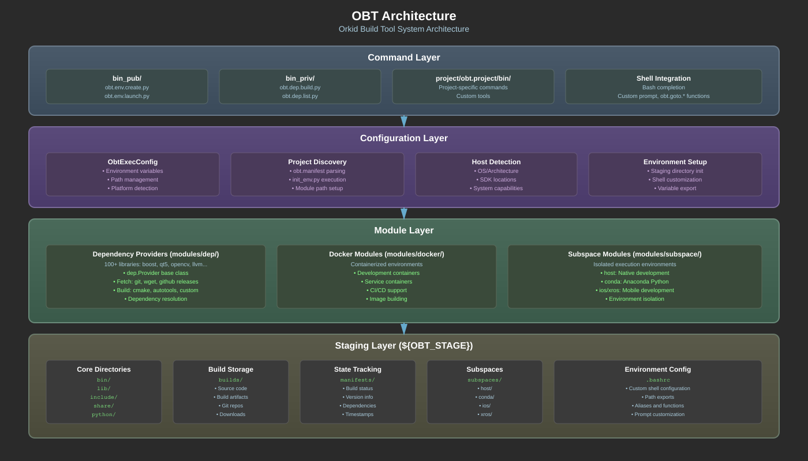
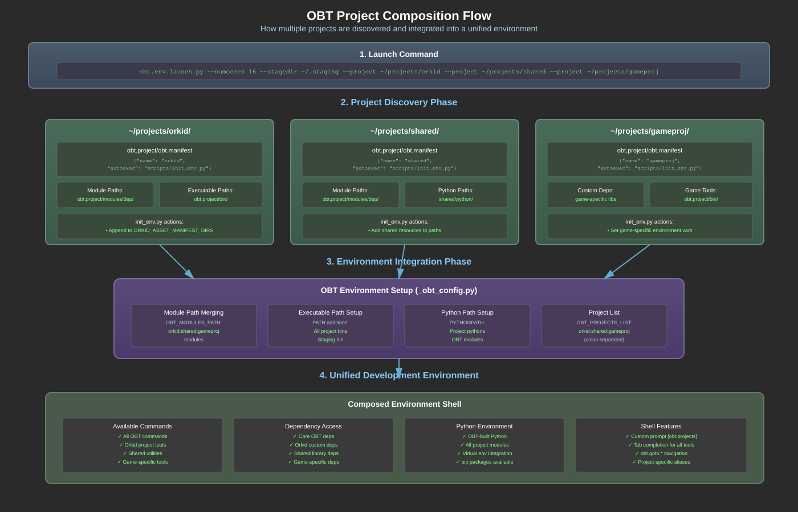

# OBT (Orkid Build Tool) - Technical Design Document

---

## Overview

OBT is a build environment orchestrator designed to manage complex multi-language software projects with extensive dependency trees. It provides a unified interface for dependency management across different languages, platforms, and build systems.

### What It Does

- **Environment Management**: Creates isolated staging environments for builds
- **Dependency Orchestration**: Manages 100+ external libraries across multiple languages
- **Project Composition**: Combines multiple projects with their own dependencies into unified environments
- **Cross-Platform Consistency**: Provides identical interfaces on Linux, macOS, and WSL2
- **Multi-Target Composition**: Build products for several architectures and operating systems in 1 staging folder. useful for large multiplatform products. eg. MacOs, Android, Linux-x86_64, Linux-Aarch64

### What It Doesn't Do

- **Not a General Package Manager**: OBT wraps other package managers rather than replacing them. OBT realizes dependencies only for your projects.
- **Not a Deployment Container Runtime**: Build containers, not deployment containers
- **Not a Build System**: Orchestrates existing build systems (CMake, Make, etc.)

### Key Benefits

- **Unified Interface**: Same commands work across all platforms (for the most part)
- **Reproducible Builds**: Locked dependency versions ensure consistency
- **Project Isolation**: Staging environments prevent system pollution
- **Language Agnostic**: Supports C++, Python, Rust, JavaScript, and more

---

## Core Concepts

### Staging Environment

A self-contained directory tree containing all build products, tools, and dependencies:

```
${OBT_STAGE}/
├── bin/           # Executables
├── lib/           # Shared libraries
├── include/       # Header files
├── builds/        # Source and build directories
├── manifests/     # Build status tracking
├── python/        # Custom Python installation
└── subspaces/     # Isolated execution environments
```

### Project Composition

Projects declare themselves via `obt.project/obt.manifest` and are composed at environment launch:

```bash
obt.env.launch.py --numcores 16 --stagedir ~/.staging \
  --project ~/projects/orkid \
  --project ~/projects/shared \
  --project ~/projects/gameproj
```

### Dependency Providers

Modular Python scripts that know how to fetch, build, and install specific libraries:
- Located in `modules/dep/` directories
- Inherit from `dep.Provider` or `dep.StdProvider`
- Handle git repos, tarballs, system packages
- Support incremental builds and caching

### Subspaces

Isolated environments within the staging directory:
- **host**: Default subspace for native development
- **conda**: Anaconda-based Python environment
- **ios/xros**: Mobile development environments

---

## Architecture



The architecture consists of four main layers:

1. **Command Layer**: User-facing Python scripts in `bin_pub/` and `bin_priv/`
2. **Configuration Layer**: Environment setup and project discovery
3. **Module Layer**: Dependency providers, docker modules, subspace definitions
4. **Staging Layer**: Physical filesystem containing build products

---

## Project Composition Flow



### Discovery and Integration Process

1. **Launch Command**: User specifies projects via `--project` arguments
2. **Manifest Discovery**: OBT finds `obt.project/obt.manifest` in each project
3. **Module Path Setup**: Project modules added to `OBT_MODULES_PATH`
4. **Environment Script**: Each project's `init_env.py` executes
5. **Path Integration**: Executables, libraries, Python paths merged
6. **Unified Environment**: All projects accessible in single shell

### Project Structure

Projects become OBT-aware by adding:

```
project_root/
├── obt.project/
│   ├── obt.manifest          # Project metadata
│   ├── scripts/              # scripts root (added to python path)
│   │   └── init_env.py       # Environment setup
│   │   └-- project_name      # extension python module (eg. import project_name)
│   ├── modules/              # Optional custom modules
│   │   └── dep/              # Custom dependencies
│   │   └── docker/           # Custom docker modules
│   └── bin/                  # Project-specific tools (added to $PATH)
```

### Manifest Format

```json
{
  "name": "myproject",
  "version": "1.0.0",
  "autoexec": "scripts/init_env.py"
}
```

### init_env.py Example

```python
from project.path
import obt.env
import os

def setup():
    """Called during project initialization"""
    project_root = project.path.root
    
    # Add to Python path
    obt.env.append("PYTHONPATH",project_root/"python")
    
    # Add to executable path
    obt.env.append("PATH",project_root/"bin")
    
    # Set project-specific variables
    obt.env.set("MYPROJECT_ROOT", project_root)
    
    # Append to shared variables (like ORKID_ASSET_MANIFEST_DIRS)
    obt.env.append("ORKID_ASSET_MANIFEST_DIRS", project_root/"asset_manifests")
```

---

## Dependency Management

### Dependency Resolution

OBT uses topological sorting to build dependencies in correct order:

```
obt.dep.status.py oiio

Dependency(RevTopoOrder)   Supported   Manifest   SrcPresent   BinPresent
0. oiio                     True        True       True         True
1. openexr                  True        True       True         True
2. pybind11                 True        True       True         True
3. cmake                    True        True       True         True
4. jpegturbo                True        True       True         False
5. python                   True        True       True         True
```

### Multi-Language Support

OBT handles dependencies across different ecosystems:

- **C/C++**: CMake, Autotools, custom builds
- **Python**: pip packages, source builds
- **Rust**: Cargo integration
- **Node.js**: npm packages
- **System**: apt/homebrew packages

### Build Lifecycle

1. **Check**: Verify if dependency already built
2. **Fetch**: Download source (git/wget/github)
3. **Configure**: Run build system configuration
4. **Build**: Compile the dependency
5. **Install**: Copy to staging directory
6. **Manifest**: Record build status

---

## Environment Variables

### Core Variables

- `OBT_STAGE`: Root staging directory
- `OBT_BUILDS`: Source/build directory location
- `OBT_SUBSPACE`: Currently active subspace
- `OBT_PROJECTS_LIST`: Colon-separated list of loaded projects
- `OBT_MODULES_PATH`: Module search paths
- `OBT_SEARCH_PATH`: Text search paths (for obt.find.py)

### Path Management

OBT manages multiple path variables:
- `PATH`: Executables
- `PYTHONPATH`: Python modules
- `LD_LIBRARY_PATH` (Linux) / `DYLD_LIBRARY_PATH` (macOS): Libraries
- `PKG_CONFIG_PATH`: Package config files
- `CMAKE_PREFIX_PATH`: CMake find modules

---

## Command Reference

### Environment Commands

- `obt.env.create.py`: Create new staging environment
- `obt.env.launch.py`: Launch environment with projects

### Dependency Commands

- `obt.dep.list.py`: List available dependencies
- `obt.dep.build.py <name>`: Build specific dependency
- `obt.dep.status.py <name>`: Check dependency status
- `obt.dep.require.py <name>`: Ensure dependency is built

### Utility Commands

- `obt.find.py <pattern>`: Search across projects
- `obt.host.info.py`: Display system information

---

## Platform Support

### Supported Hosts

- **Linux x86_64**: Ubuntu 20.04, 22.04, 24.04
- **Linux aarch64**: Ubuntu 20.04, 22.04, 24.04
- **macOS x86_64**: Big Sur, Monterey
- **macOS arm64**: Big Sur, Monterey, Sonoma
- **Windows**: WSL2 with Ubuntu

### Platform-Specific Notes

- **Linux**: Requires sudo for system dependencies
- **macOS**: Requires Xcode and Homebrew
- **WSL2**: Full Linux compatibility

---

## FAQ

### When should I use OBT?

OBT is ideal when you need to:
- Manage complex projects with many external dependencies
- Ensure reproducible builds across team members
- Compose multiple projects with different requirements
- Avoid polluting system directories with development libraries

### How does OBT relate to the VFX Reference Platform?

OBT shares qualities with the VFX Reference Platform approach to standardizing dependencies. I started working on OBT (or its predecssor) when I wanted to integrate a lot of VFX centric libraries into Orkid. Doing so in 2014 was very problematic from a build perspective, hence OBT was born. Like VfxRP - OBT maintains (and will continue to maintain) a set of fixed versions of key packages to aid in behavioral and build stability. Plans are in place to make OBT based project VFX Reference Platform CY2026 compliant.  

### Can I use OBT with existing build systems?

Yes, OBT wraps existing build systems. It doesn't replace CMake, Make, or other tools - it orchestrates them. That said, OBT wants to be 'king' in the build system hierarchy. The types of projects OBT is used to build tend to be much larger in scope than most of the dependencies it manages. 

### How does project composition differ from dependency management?

Dependencies are external libraries managed by third parties (like boost, Qt). Project composition combines your own projects that may have different dependency requirements into a unified environment.

### What's the difference between OBT and Docker?

OBT creates build environments for development, compilation and testing. Docker creates runtime containers for deployment of services. You might use OBT to build artifacts that get packaged into Docker containers, alternatively you might use docker containers to build artifacts for OBT based project consumption.

### Can projects override or extend OBT functionality?

Yes, projects can:
- Add custom dependency providers
- Define project-specific commands
- Extend environment setup via init_env.py
- Add custom modules in obt.project/modules/

### Why does OBT build it's own python ?

Because Orkid based projects build c++ extension modules that want a stable python API. Specifically  3.12 is chosen for subinterpreter functionality, which orkid actually uses in the ECS (entity component system). The OBT managed Python version will be updated periodically.


